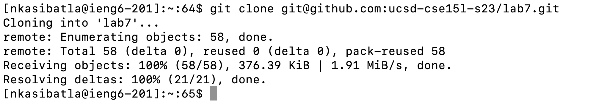
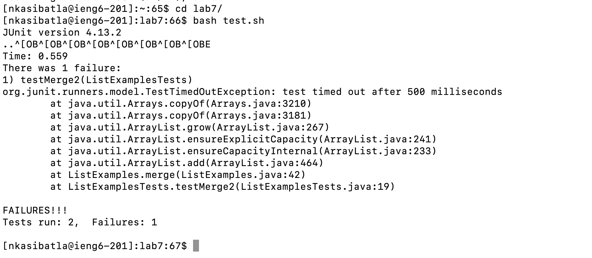
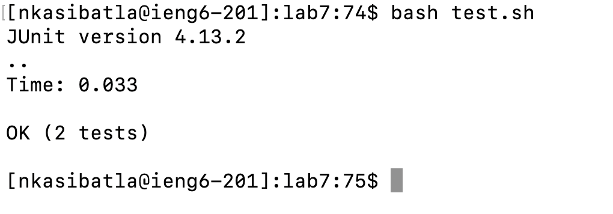

# CSE 15L Lab Report 4: Vim

## Task
1. Log into ieng6
2. Clone your fork of the repository from your Github account (using the SSH URL)
3. Run the tests, demonstrating that they fail
4. Edit the code file to fix the failing test
5. Run the tests, demonstrating that they now succeed
6. Commit and push the resulting change to your Github account (you can pick any commit message!)

## Step 4


Keys Pressed
```
ssh<space>nkasibatla@ieng6.ucsd.edu<enter>
```
Explanation:
The commannd is never run in the terminal, which we need to type out the entire command including the host that we’re connecting to. The ssh key is already set up, so no password required.

## Step 5


Keys Pressed 
```
<open-website(https://github.com/ucsd-cse15l-s23/lab7)>
<click-button(<> Code)>
<click-button(copy)>
<open-terminal>
git<space>clone<space><right-click>
```
Explanation:
First go to webiste and copy the link by clicking the copy button in the website that copy the ```ssh``` link of the repository. Then go back to terminal type out the ```git clone``` commmand and use right click to paste the link that we copy from the website ```https://github.com/ucsd-cse15l-s23/lab7```.

## Step 6


Keys Pressed
```
cd<space>l<tab><enter>
bash<space>t<tab><enter>
```
Explanation:
First use ```cd``` command to go in the directory we just clone. Since only ```lab7``` directory start with ```l```, type ```l``` and then ```<tab>``` to auto-complete the directory name and press enter to execute. We then run the ```test.sh``` file by first type ```bash```, and then type ```t``` and then ```<tab>``` to auto-complete the file name since only ```test.sh``` start with ```t```.

## Step 7
.png)

Keys Pressed
```
vim<space>L<tab>.<tab><enter>
```
Explanation:
First type ```vim``` command to open the ```vim``` editor for the .java file. Specify the file to open by first type ```L``` to specify the file name and tab to auto complete to ```ListExamples```, then type . and tab to specify the file name to ```ListExamples.java``` instead of ```ListExamplesTests.java```.

.png)

Keys Pressed
```
:set number<enter>
44gg
e
i
<rightkey>
<delete>
2
<esc>
:x<enter>
```
Explanation:
First type ```:set number<enter>``` to make the vim editor to display the line number. Next, use ```44gg``` to jump the cursor to line 44 since the code we want to fix is at line 44. After that, the ```e``` command move to the very end of the word ```index1```,then use the right key to move behind the 1, and change the mode to insert mode using ```i``` command. Then, we delete the number 1 with ```<delete>``` and type the number ```2``` in. Finally, we save the file by changing the mode to the normal mode by pressing ```esc```, and save and quit the vim editor by typing ```:x<enter>```.

## Step 8


Key Pressed:
```
bash<space>t<tab><enter>
```

We use the ```bash``` command to run the ```test.sh``` bash script, which we first type ```bash<space>t``` and auto-complete the file name by typing ```<tab>``` and then ```<enter>``` to execute the command.

## Step 9


