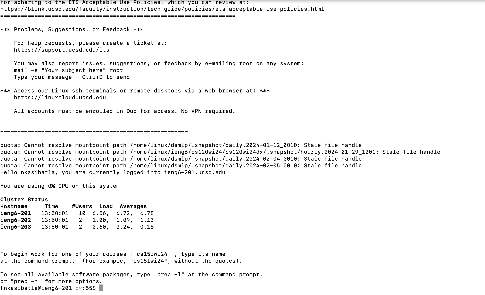

# CSE 15L Lab Report 4: Vim

## Task
1. Log into ieng6
2. Clone your fork of the repository from your Github account (using the SSH URL)
3. Run the tests, demonstrating that they fail
4. Edit the code file to fix the failing test
5. Run the tests, demonstrating that they now succeed
6. Commit and push the resulting change to your Github account (you can pick any commit message!)

## Step 4


Keys Pressed
```
ssh<space>nkasibatla@ieng6.ucsd.edu<enter>
```
Explanation:
The commannd is never run in the terminal, which we need to type out the entire command including the host that we’re connecting to. The ssh key is already set up, so no password required.

## Step 5


